# Cowry — Digital Banking Platform

Cowry is a full-stack digital banking application built as a monorepo. It provides core personal banking features — account management, card issuance, money transfers — together with social payment tools (split bills, payment requests), two-factor authentication, fraud detection, and an admin panel.

---

## Table of Contents

- [Features](#features)
- [Tech Stack](#tech-stack)
- [Project Structure](#project-structure)
- [Testing](#testing)
  - [Test Stack](#test-stack)
  - [Running the Tests](#running-the-tests)
  - [Test Results](#test-results)
  - [Test Coverage](#test-coverage)
  - [E2E Tests](#e2e-tests)
- [Running the Application on a New Device](#running-the-application-on-a-new-device)
  - [System Requirements](#system-requirements)
  - [1. Install Node.js](#1-install-nodejs)
  - [2. Install pnpm](#2-install-pnpm)
  - [3. Install and Configure MySQL](#3-install-and-configure-mysql)
  - [4. Clone the Repository](#4-clone-the-repository)
  - [5. Install Dependencies](#5-install-dependencies)
  - [6. Set Up External Services](#6-set-up-external-services)
  - [7. Configure Environment Variables](#7-configure-environment-variables)
  - [8. Create the Database](#8-create-the-database)
  - [9. Run in Development](#9-run-in-development)
  - [10. Verify the Setup](#10-verify-the-setup)
  - [Building for Production](#building-for-production)
- [Environment Variables Reference](#environment-variables-reference)
- [API Overview](#api-overview)
- [Authentication Flow](#authentication-flow)
- [Database Models](#database-models)
- [Frontend Pages](#frontend-pages)
- [Security](#security)
- [Admin Panel](#admin-panel)

---

## Testing

The project has a three-layer test suite: backend unit and integration tests (Vitest + supertest), frontend component and hook tests (Vitest + React Testing Library), and end-to-end browser tests (Playwright).

### Test Stack

| Layer | Tool | Scope |
|---|---|---|
| Backend unit & integration | Vitest, supertest | Services, middleware, route contracts |
| Frontend unit | Vitest, React Testing Library, jsdom | Components, hooks, utilities |
| End-to-end | Playwright (Chromium, Firefox, Mobile Chrome) | Full user flows against live servers |

### Running the Tests

```bash
# Run all backend + frontend unit and integration tests
pnpm test

# Backend only (watch mode)
pnpm test:backend

# Frontend only (watch mode)
pnpm test:frontend

# Generate coverage reports
pnpm --filter @cowry/backend test:coverage
pnpm --filter @cowry/frontend test:coverage

# End-to-end (requires both servers running or will start them automatically)
pnpm test:e2e
```

### Test Results

All 192 unit and integration tests pass.

#### Backend — 145 tests across 9 files

| Suite | File | Tests |
|---|---|---|
| Auth middleware | `unit/middleware/auth.middleware.test.ts` | 13 |
| Step-up middleware | `unit/middleware/stepup.middleware.test.ts` | 7 |
| Validation middleware | `unit/middleware/validation.middleware.test.ts` | 25 |
| Auth service | `unit/services/auth.service.test.ts` | 33 |
| Account service | `unit/services/account.service.test.ts` | 17 |
| Card model utils | `unit/models/card.utils.test.ts` | 8 |
| Auth routes (integration) | `integration/auth.routes.test.ts` | 18 |
| Account routes (integration) | `integration/account.routes.test.ts` | 15 |
| Admin routes (integration) | `integration/admin.routes.test.ts` | 9 |

```
Test Files  9 passed (9)
     Tests  145 passed (145)
  Duration  ~1.2s
```

#### Frontend — 47 tests across 5 files

| Suite | File | Tests |
|---|---|---|
| Button component | `unit/components/button.test.tsx` | 11 |
| StepUpModal component | `unit/components/step-up-modal.test.tsx` | 14 |
| useStepUp hook | `unit/hooks/use-step-up.test.ts` | 8 |
| cn() utility | `unit/lib/utils.test.ts` | 7 |
| Login page | `pages/login.test.tsx` | 7 |

```
Test Files  5 passed (5)
     Tests  47 passed (47)
  Duration  ~1.2s
```

### Test Coverage

Key areas covered by the unit and integration test suites:

**Auth service** — user registration (duplicate email/phone), login (MFA challenge, account lockout after 5 attempts, locked account, unverified email), email verification, password reset (anti-enumeration), change password, TOTP setup/enable/disable, backup codes, refresh token rotation and reuse detection.

**Account service** — account creation (duplicate type guard), ownership checks, deposit (suspended account), withdrawal (insufficient funds, daily limit enforcement: £2,500 savings / £5,000 current), transfers (same account, currency mismatch, destination not found, insufficient funds).

**Middleware** — JWT extraction and validation, MFA requirement gate, admin role enforcement, step-up token verification (missing header, wrong action, wrong type, user mismatch, expired, malformed), request body validation rules.

**Integration routes** — full HTTP contract tests for every route group: correct status codes (401 unauthenticated, 403 insufficient role, 400 validation, 409 conflict, 200/201 success), MFA-setup-required enforcement, step-up enforcement on `PUT /auth/change-password`.

**Frontend** — Button variants and interaction, StepUpModal visibility/input/submit/dismiss behaviour, `useStepUp` state machine (open, submit, dismiss, cancel, error states), `cn()` Tailwind merge utility, LoginPage (standard login, MFA redirect, setup-MFA redirect, error messages).

### E2E Tests

Playwright tests cover four flows. They run against live backend (:3000) and frontend (:3001) servers, which Playwright starts automatically.

| Spec | Scenarios |
|---|---|
| `auth.spec.ts` | Registration, email verification, login, wrong-password lockout (5 attempts), forgot-password reset, MFA setup and MFA login |
| `accounts.spec.ts` | Account creation, deposit, withdrawal, transfer, transaction history |
| `cards.spec.ts` | Issue virtual card, freeze, unfreeze (step-up modal check), reveal card details (step-up modal check) |
| `admin.spec.ts` | Audit log RBAC (403 for regular users), risk-level filtering, resolve alert, users table |

To run E2E tests with a visible browser:
```bash
pnpm test:e2e --headed
```

To install Playwright browsers (first time only):
```bash
npx playwright install chromium
```

---

## Features

### Banking Core
- Create and manage savings and current accounts
- Deposit, withdraw, and transfer funds between accounts
- Full transaction history with downloadable statements
- Individual transaction detail views

### Virtual Cards
- Issue virtual and disposable cards linked to accounts
- Freeze / unfreeze cards
- Block / unblock cards
- Cancel cards
- Reveal full card details (step-up protected)
- Merchant-level card blocks

### Social Payments
- Search users by `@tag`
- Save payee contacts
- Request money from other users
- Split bills across multiple participants — pay or decline individual requests

### Authentication & Security
- Email/password registration with email verification
- Passwordless Google OAuth 2.0
- TOTP-based multi-factor authentication (authenticator app + QR code)
- MFA backup codes for account recovery
- 6-digit passcode for quick unlock
- Step-up OTP verification for sensitive operations (large transfers, card reveals, etc.) — codes delivered via email
- JWT access + refresh token pair (httpOnly cookie for refresh)
- Proactive token refresh (2 minutes before expiry)
- Session management with device and location tracking
- Inactivity auto-lock

### Fraud Detection
- Geolocation-based login monitoring
- Automated fraud alerts with risk levels (LOW / MEDIUM / HIGH)
- Audit log of flagged events (admin only)

### Admin
- View all users
- View and resolve fraud alerts
- Friendly rule names, location info, and timestamps in audit log

---

## Tech Stack

| Layer | Technology |
|---|---|
| Frontend | Next.js 16, React 19, TypeScript, Tailwind CSS 4, shadcn/ui |
| Backend | Express 5, Node.js, TypeScript, Passport.js |
| Database | MySQL (raw queries via mysql2/promise connection pool) |
| Auth | JWT, Google OAuth 2.0, TOTP (speakeasy), bcrypt |
| Email / OTP | Mailjet |
| Package Manager | pnpm (workspaces) |
| Shared Types | `@cowry/types` (workspace package) |

---

## Project Structure

```
cowry/
├── apps/
│   ├── backend/              # Express API server
│   │   └── src/
│   │       ├── app.ts        # Entry point, middleware stack
│   │       ├── config/       # Database pool, Passport strategies, schema.sql
│   │       ├── controllers/  # Route handlers (auth, account, card, admin)
│   │       ├── middleware/   # Auth, validation, step-up
│   │       ├── models/       # Raw SQL models
│   │       ├── routers/      # Express route definitions
│   │       └── services/     # Business logic (auth, account, card, email)
│   └── frontend/             # Next.js application
│       ├── app/              # App Router pages
│       │   ├── (auth)/       # Public auth pages
│       │   ├── dashboard/    # Protected user pages
│       │   └── setup-*/      # Post-login onboarding pages
│       ├── components/       # Shared React components
│       ├── lib/              # API client, auth context, hooks, utils
│       └── middleware.ts     # Next.js route protection
└── packages/
    └── types/                # Shared TypeScript types and enums (@cowry/types)
```

---

## Running the Application on a New Device

Follow these steps in order on a fresh machine.

### System Requirements

| Tool | Minimum Version | Check |
|---|---|---|
| Node.js | 18.x | `node -v` |
| pnpm | 8.x | `pnpm -v` |
| MySQL | 5.7 | `mysql --version` |
| Git | Any recent | `git --version` |

---

### 1. Install Node.js

**macOS (via Homebrew):**
```bash
brew install node
```

**Windows / Linux:**
Download the LTS installer from https://nodejs.org

Verify:
```bash
node -v   # should print v18.x.x or higher
npm -v
```

---

### 2. Install pnpm

pnpm is the package manager used across the whole monorepo.

```bash
npm install -g pnpm
```

Verify:
```bash
pnpm -v   # should print 8.x.x or higher
```

---

### 3. Install and Configure MySQL

**macOS (via Homebrew):**
```bash
brew install mysql
brew services start mysql
```

**Ubuntu / Debian:**
```bash
sudo apt update
sudo apt install mysql-server
sudo systemctl start mysql
sudo systemctl enable mysql
```

**Windows:**
Download the MySQL Community Installer from https://dev.mysql.com/downloads/installer/ and follow the setup wizard.

#### Secure the installation (Linux/macOS)

After installing, run the security script to set a root password:

```bash
mysql_secure_installation
```

Choose a strong root password and answer `Y` to the remaining prompts.

#### Create a MySQL user for the application (recommended)

Log in as root:
```bash
mysql -u root -p
```

Then run:
```sql
CREATE USER 'cowry_user'@'localhost' IDENTIFIED BY 'your_strong_password';
GRANT ALL PRIVILEGES ON cowry.* TO 'cowry_user'@'localhost';
FLUSH PRIVILEGES;
EXIT;
```

You can also use the root user directly for local development — just set `DB_USER=root` and `DB_PASSWORD=<your root password>` in `.env`.

---

### 4. Clone the Repository

```bash
git clone <repo-url>
cd cowry
```

---

### 5. Install Dependencies

From the repo root, install all workspace dependencies in one command:

```bash
pnpm install
```

This installs packages for the backend, frontend, and the shared types package simultaneously.

---

### 6. Set Up External Services

The backend requires accounts with three third-party services. Collect the credentials before writing your `.env` file.

#### Mailjet (email delivery)

Cowry uses Mailjet to send verification emails and password reset links.

1. Create a free account at https://www.mailjet.com
2. Go to **Account Settings → API Keys**
3. Copy your **API Key** and **Secret Key**
4. Verify a sender email address under **Senders & Domains**

#### Google OAuth (optional — for "Sign in with Google")

If you want Google login to work:

1. Go to https://console.cloud.google.com
2. Create a new project (or select an existing one)
3. Navigate to **APIs & Services → Credentials**
4. Click **Create Credentials → OAuth 2.0 Client ID**
5. Set **Application type** to **Web application**
6. Add `http://localhost:3001` to **Authorised JavaScript origins**
7. Add `http://localhost:3000/api/v1/auth/google/callback` to **Authorised redirect URIs**
8. Copy the **Client ID** and **Client Secret**

If you skip this, the Google login button on the frontend will not work, but everything else will function normally.

---

### 7. Configure Environment Variables

#### Backend

Create the backend environment file from the example:

```bash
cp apps/backend/.env.example apps/backend/.env
```

Open `apps/backend/.env` and fill in every value:

```env
# Server
PORT=3000
NODE_ENV=development

# Database
DB_NAME=cowry
DB_USER=cowry_user          # or root
DB_PASSWORD=your_password
DB_HOST=localhost
DB_PORT=3306

# JWT — generate two separate random strings (64+ characters each)
# You can generate one with: node -e "console.log(require('crypto').randomBytes(64).toString('hex'))"
JWT_SECRET=<generated_secret>
JWT_REFRESH_SECRET=<generated_secret>
JWT_ACCESS_EXPIRES_IN=15m
JWT_REFRESH_EXPIRES_IN=7d

# Session
SESSION_SECRET=<generated_secret>

# Frontend URL (used for CORS and email links)
CLIENT_URL=http://localhost:3001

# Google OAuth (leave blank if not using Google login)
GOOGLE_CLIENT_ID=
GOOGLE_CLIENT_SECRET=
GOOGLE_CALLBACK_URL=http://localhost:3000/api/v1/auth/google/callback

# Mailjet (email delivery — verification, password reset, OTP codes)
MAILJET_API_KEY=<from mailjet dashboard>
MAILJET_SECRET_KEY=<from mailjet dashboard>
```

To generate a secure random secret:
```bash
node -e "console.log(require('crypto').randomBytes(64).toString('hex'))"
```
Run this three times to get distinct values for `JWT_SECRET`, `JWT_REFRESH_SECRET`, and `SESSION_SECRET`.

#### Frontend

Create the frontend environment file:

```bash
cp apps/frontend/.env.example apps/frontend/.env.local
```

If no example file exists, create `apps/frontend/.env.local` manually:

```env
NEXT_PUBLIC_API_URL=http://localhost:3000/api/v1
```

---

### 8. Create the Database

Log into MySQL and create the database:

```bash
mysql -u root -p
```

```sql
CREATE DATABASE cowry CHARACTER SET utf8mb4 COLLATE utf8mb4_unicode_ci;
EXIT;
```

> **Note:** You do not need to run any migration files manually. The backend reads `src/config/schema.sql` on startup and creates all tables automatically the first time it runs.

---

### 9. Run in Development

Open two terminal windows (or tabs) from the repo root.

**Terminal 1 — Backend:**
```bash
pnpm dev:backend
```

You should see output like:
```
Server running on port 3000
Database connected successfully
```

**Terminal 2 — Frontend:**
```bash
pnpm dev:frontend
```

You should see:
```
▲ Next.js 16.x.x
- Local: http://localhost:3001
```

The application is now running:
- **Frontend:** http://localhost:3001
- **Backend API:** http://localhost:3000/api/v1
- **Health check:** http://localhost:3000/health

---

### 10. Verify the Setup

1. Open http://localhost:3001 — the landing page should load
2. Open http://localhost:3000/health — should return `{"status":"ok"}`
3. Register a new account at `/register`
4. Check your email inbox for the verification link (sent via Mailjet)
5. Click the link to verify your email, then log in
6. Complete the MFA setup when prompted (use any TOTP app: Google Authenticator, Authy, etc.)
7. You should land on the dashboard

---

### Building for Production

```bash
# Build the backend (compiles TypeScript to dist/)
pnpm build:backend

# Build the frontend (creates an optimised Next.js build)
pnpm build:frontend

# Start the backend in production mode
pnpm start:backend

# Start the frontend in production mode (from apps/frontend/)
cd apps/frontend && pnpm start
```

Set `NODE_ENV=production` in the backend `.env` for production — this enables HSTS, strict CSP, and disables stack traces in error responses.

---

## Environment Variables Reference

### Backend — `apps/backend/.env`

| Variable | Required | Description |
|---|---|---|
| `PORT` | Yes | Backend server port (default `3000`) |
| `NODE_ENV` | Yes | `development` or `production` |
| `DB_NAME` | Yes | MySQL database name |
| `DB_USER` | Yes | MySQL username |
| `DB_PASSWORD` | Yes | MySQL password |
| `DB_HOST` | Yes | MySQL host (usually `localhost`) |
| `DB_PORT` | Yes | MySQL port (usually `3306`) |
| `JWT_SECRET` | Yes | Secret for signing access tokens |
| `JWT_REFRESH_SECRET` | Yes | Secret for signing refresh tokens |
| `JWT_ACCESS_EXPIRES_IN` | Yes | Access token lifetime (e.g. `15m`) |
| `JWT_REFRESH_EXPIRES_IN` | Yes | Refresh token lifetime (e.g. `7d`) |
| `SESSION_SECRET` | Yes | Express session secret |
| `CLIENT_URL` | Yes | Frontend origin for CORS and email links |
| `GOOGLE_CLIENT_ID` | No | Google OAuth client ID |
| `GOOGLE_CLIENT_SECRET` | No | Google OAuth client secret |
| `GOOGLE_CALLBACK_URL` | No | Google OAuth redirect URI |
| `MAILJET_API_KEY` | Yes | Mailjet public API key |
| `MAILJET_SECRET_KEY` | Yes | Mailjet secret key |

### Frontend — `apps/frontend/.env.local`

| Variable | Required | Description |
|---|---|---|
| `NEXT_PUBLIC_API_URL` | Yes | Base URL of the backend API |

---

## API Overview

All endpoints are prefixed with `/api/v1`. A Postman collection (`Cowry.postman_collection.json`) is included in the repo root for manual testing.

### Auth — `/auth/...`

| Method | Path | Auth | Description |
|---|---|---|---|
| POST | `/auth/register` | Public | Register a new user |
| POST | `/auth/login` | Public | Login, returns `accessToken` |
| POST | `/auth/forgot-password` | Public | Send password reset email |
| POST | `/auth/reset-password` | Public | Reset password with token |
| GET | `/auth/verify-email` | Public | Verify email address |
| POST | `/auth/refresh-token` | Public | Rotate access token |
| GET | `/auth/google` | Public | Initiate Google OAuth |
| GET | `/auth/google/callback` | Public | Google OAuth callback |
| POST | `/auth/logout` | Protected | Invalidate session |
| GET | `/auth/profile` | Protected | Get current user profile |
| PATCH | `/auth/profile` | Protected | Update profile |
| POST | `/auth/change-password` | Protected | Change password |
| GET | `/auth/sessions` | Protected | List active sessions |
| DELETE | `/auth/sessions/:id` | Protected | Revoke a session |
| POST | `/auth/mfa/setup` | Protected | Generate TOTP secret + QR code |
| POST | `/auth/mfa/verify` | Protected | Confirm TOTP and enable MFA |
| POST | `/auth/mfa/backup-codes` | Protected | Generate backup codes |
| POST | `/auth/otp/send` | Protected | Send step-up OTP |
| POST | `/auth/otp/verify` | Protected | Verify step-up OTP |
| POST | `/auth/passcode/set` | Protected | Set 6-digit passcode |
| POST | `/auth/passcode/verify` | Protected | Verify passcode |

### Accounts — `/accounts/...`

> Requires authentication and MFA enabled.

| Method | Path | Description |
|---|---|---|
| POST | `/accounts` | Create a new account |
| GET | `/accounts` | List all accounts for the user |
| GET | `/accounts/:id` | Get account details |
| POST | `/accounts/:id/deposit` | Deposit funds |
| POST | `/accounts/:id/withdraw` | Withdraw funds |
| POST | `/accounts/:id/transfer` | Transfer to another account |
| GET | `/accounts/:id/transactions` | Transaction history |
| GET | `/accounts/:id/statement` | Download statement |

### Cards

> Requires authentication and MFA enabled.

| Method | Path | Description |
|---|---|---|
| POST | `/cards/issue` | Issue a new virtual card |
| GET | `/cards` | List all cards |
| POST | `/cards/:id/reveal` | Reveal full card details (step-up) |
| PATCH | `/cards/:id/freeze` | Freeze a card |
| PATCH | `/cards/:id/unfreeze` | Unfreeze a card (step-up) |
| PATCH | `/cards/:id/block` | Block a card |
| PATCH | `/cards/:id/unblock` | Unblock a card (step-up) |
| DELETE | `/cards/:id/cancel` | Cancel a card (step-up) |
| POST | `/cards/:id/disposable` | Issue a disposable card |
| POST | `/cards/:id/merchant-blocks` | Block a merchant |
| GET | `/cards/:id/merchant-blocks` | List merchant blocks |
| DELETE | `/cards/:id/merchant-blocks/:blockId` | Remove merchant block |

### Transactions

| Method | Path | Description |
|---|---|---|
| GET | `/transactions/:id` | Get transaction details |

### Social Payments

| Method | Path | Description |
|---|---|---|
| GET | `/users/search?tag=` | Search users by @tag |
| GET | `/contacts` | List saved contacts |
| POST | `/contacts` | Add a contact |
| DELETE | `/contacts/:id` | Remove a contact |
| POST | `/splits` | Create a split request |
| GET | `/splits` | List incoming/outgoing splits |
| POST | `/splits/:id/pay` | Pay a split |
| POST | `/splits/:id/decline` | Decline a split |
| POST | `/payment-requests` | Request money from a user |
| GET | `/payment-requests` | List payment requests |
| POST | `/payment-requests/:id/pay` | Pay a request |
| POST | `/payment-requests/:id/decline` | Decline a request |

### Admin

> Requires `ADMIN` role.

| Method | Path | Description |
|---|---|---|
| GET | `/admin/audit-log` | Paginated fraud alert log |
| PATCH | `/admin/audit-log/:alertId/resolve` | Resolve a fraud alert |
| GET | `/admin/users` | List all users |

---

## Authentication Flow

1. **Register:** user submits email + password → receives a verification email
2. **Verify email:** click link → account activated
3. **Login:** `POST /auth/login` returns `accessToken` in the JSON body; `refreshToken` is set as an httpOnly cookie and is never exposed to JavaScript
4. **MFA setup** (required before accessing accounts/cards) — scan QR code in an authenticator app → confirm TOTP → MFA enabled
5. **Token refresh:** the frontend proactively refreshes 2 minutes before expiry and retries automatically on any 401 response
6. **Step-up verification:** sensitive actions (large transfers, card reveals, unfreeze/unblock) require a short-lived OTP before the operation proceeds

---

## Database Models

The schema is defined in `apps/backend/src/config/schema.sql` and is applied automatically on backend startup. All queries use the raw `mysql2/promise` connection pool — no ORM.

| Model | Purpose |
|---|---|
| `user` | User accounts, credentials, role, MFA status |
| `account` | Bank accounts (savings / current), balance |
| `card` | Virtual cards, freeze/block state |
| `transaction` | Ledger entries (credit / debit) |
| `transfer` | Fund transfer records |
| `session` | Active sessions with device + location info |
| `otpCode` | Step-up OTP codes |
| `mfaBackupCode` | MFA recovery codes |
| `emailVerification` | Email verification tokens |
| `passwordReset` | Password reset tokens |
| `fraudAlert` | Flagged security events |
| `contact` | Saved payee contacts |
| `splitRequest` | Split bill requests and participants |
| `paymentRequest` | Peer payment requests |
| `merchantBlock` | Per-card merchant blocks |

### Entity Relationship Diagram

```mermaid
erDiagram
    USERS {
        char(36) id PK
        varchar(255) email UK
        varchar(255) password
        varchar(100) first_name
        varchar(100) last_name
        enum role "user|admin"
        enum status "active|suspended|locked"
        varchar(255) google_id UK
        text profile_picture
        datetime last_login
        varchar(45) last_login_ip
        int login_attempts
        datetime lock_until
        varchar(20) phone_number UK
        varchar(32) tag UK
        varchar(255) passcode_hash
        varchar(64) avatar
        tinyint(1) is_mfa_enabled
        varchar(255) mfa_secret
        tinyint(1) email_verified
        text refresh_token
        datetime created_at
        datetime updated_at
    }

    SESSIONS {
        char(36) id PK
        char(36) user_id FK
        text token
        text refresh_token
        varchar(45) ip_address
        text user_agent
        json location
        json device_info
        datetime expires_at
        tinyint(1) is_valid
        datetime created_at
        datetime updated_at
    }

    ACCOUNTS {
        char(36) id PK
        char(36) user_id FK
        varchar(8) account_number UK
        varchar(6) sort_code
        enum account_type "savings|current"
        varchar(3) currency
        decimal(15_2) balance
        enum status "active|suspended"
        datetime created_at
    }

    CARDS {
        char(36) id PK
        char(36) account_id FK
        enum card_type "debit|prepaid|disposable"
        text card_number
        varchar(4) last_four
        tinyint expiry_month
        smallint expiry_year
        text cvv
        tinyint(1) is_frozen
        enum status "active|frozen|blocked|cancelled|used"
        tinyint(1) is_disposable
        datetime expires_at
        datetime created_at
    }

    TRANSACTIONS {
        char(36) id PK
        char(36) account_id FK
        enum type "credit|debit"
        decimal(15_2) amount
        varchar(3) currency
        varchar(50) reference UK
        varchar(255) description
        enum status "pending|completed|failed"
        json metadata
        datetime created_at
    }

    TRANSFERS {
        char(36) id PK
        char(36) from_account_id FK
        char(36) to_account_id FK
        decimal(15_2) amount
        varchar(3) currency
        varchar(50) reference UK
        enum status "pending|completed|failed"
        datetime created_at
    }

    CONTACTS {
        char(36) id PK
        char(36) owner_user_id FK
        char(36) contact_user_id FK
        varchar(100) nickname
        varchar(8) account_number
        varchar(6) sort_code
        varchar(32) tag
        datetime created_at
    }

    PAYMENT_REQUESTS {
        char(36) id PK
        varchar(12) reference
        char(36) requester_user_id FK
        varchar(8) payer_account_number
        char(36) payer_user_id
        decimal(15_2) amount
        varchar(255) description
        enum status "pending|paid|declined|expired"
        datetime expires_at
        datetime created_at
    }

    SPLIT_REQUESTS {
        char(36) id PK
        varchar(12) reference
        char(36) initiator_user_id FK
        decimal(15_2) total_amount
        varchar(255) description
        enum status "pending|completed|cancelled"
        datetime created_at
    }

    SPLIT_PARTICIPANTS {
        char(36) id PK
        char(36) split_request_id FK
        char(36) user_id
        varchar(8) account_number
        decimal(15_2) amount
        enum status "pending|paid|declined"
        datetime paid_at
    }

    EMAIL_VERIFICATIONS {
        char(36) id PK
        char(36) user_id FK
        varchar(255) token_hash
        datetime expires_at
        tinyint(1) used
        datetime created_at
    }

    PASSWORD_RESETS {
        char(36) id PK
        char(36) user_id FK
        varchar(255) token_hash
        datetime expires_at
        tinyint(1) used
        datetime created_at
    }

    MFA_BACKUP_CODES {
        char(36) id PK
        char(36) user_id FK
        varchar(255) code_hash
        tinyint(1) used
        datetime used_at
        datetime created_at
    }

    OTP_CODES {
        char(36) id PK
        char(36) user_id FK
        varchar(64) action
        varchar(255) code_hash
        datetime expires_at
        tinyint(1) used
        datetime created_at
    }

    FRAUD_ALERTS {
        char(36) id PK
        char(36) user_id FK
        char(36) session_id FK
        varchar(100) rule_name
        enum risk_level "low|medium|high"
        text description
        varchar(45) ip_address
        json location
        json metadata
        varchar(50) action
        tinyint(1) is_resolved
        datetime resolved_at
        varchar(100) resolved_by
        datetime created_at
        datetime updated_at
    }

    MERCHANT_BLOCKS {
        char(36) id PK
        char(36) user_id FK
        varchar(255) merchant_name
        datetime created_at
    }

    USERS ||--o{ SESSIONS : "has"
    USERS ||--o{ ACCOUNTS : "owns"
    USERS ||--o{ CONTACTS : "owns (owner)"
    USERS ||--o{ CONTACTS : "referenced by (contact)"
    USERS ||--o{ PAYMENT_REQUESTS : "requests"
    USERS ||--o{ SPLIT_REQUESTS : "initiates"
    USERS ||--o{ EMAIL_VERIFICATIONS : "has"
    USERS ||--o{ PASSWORD_RESETS : "has"
    USERS ||--o{ MFA_BACKUP_CODES : "has"
    USERS ||--o{ OTP_CODES : "has"
    USERS ||--o{ FRAUD_ALERTS : "triggers"
    USERS ||--o{ MERCHANT_BLOCKS : "blocks"

    ACCOUNTS ||--o{ CARDS : "has"
    ACCOUNTS ||--o{ TRANSACTIONS : "records"
    ACCOUNTS ||--o{ TRANSFERS : "sends (from)"
    ACCOUNTS ||--o{ TRANSFERS : "receives (to)"

    SESSIONS ||--o{ FRAUD_ALERTS : "associated with"

    SPLIT_REQUESTS ||--o{ SPLIT_PARTICIPANTS : "has"
```



---

## Frontend Pages

| Route | Access | Description |
|---|---|---|
| `/` | Public | Landing page |
| `/login` | Public | Login form |
| `/register` | Public | Registration form |
| `/forgot-password` | Public | Password recovery |
| `/reset-password` | Public | Reset with token |
| `/verify-email` | Public | Email confirmation |
| `/verify-mfa` | Public | MFA challenge |
| `/setup-mfa` | Authenticated | TOTP onboarding |
| `/setup-passcode` | Authenticated | Set quick-unlock passcode |
| `/setup-avatar` | Authenticated | Profile picture selection |
| `/dashboard` | Protected | Overview and summary cards |
| `/dashboard/accounts` | Protected | Account list |
| `/dashboard/accounts/[id]` | Protected | Account detail |
| `/dashboard/accounts/[id]/deposit` | Protected | Deposit funds |
| `/dashboard/accounts/[id]/withdraw` | Protected | Withdraw funds |
| `/dashboard/accounts/[id]/transfer` | Protected | Transfer funds |
| `/dashboard/cards` | Protected | Card management |
| `/dashboard/transactions/[id]` | Protected | Transaction detail |
| `/dashboard/contacts` | Protected | Contact book |
| `/dashboard/split` | Protected | Split bill management |
| `/dashboard/request` | Protected | Payment requests |
| `/dashboard/profile` | Protected | Edit profile |
| `/dashboard/security` | Protected | Sessions and security settings |
| `/dashboard/admin` | Admin only | Admin panel |

Route protection is handled by Next.js middleware (`middleware.ts`) which reads the `accessToken` cookie. Non-admin users are redirected away from `/dashboard/admin`; admin users are redirected away from the standard `/dashboard`.

---

## Security

- **Helmet:** sets secure HTTP headers (HSTS + CSP enforced in production)
- **CORS:** restricted to `CLIENT_URL` with credentials
- **Rate limiting:** 100 requests per 15-minute window per IP on `/api`
- **bcrypt:** password hashing
- **httpOnly cookie:** refresh token is never accessible to JavaScript
- **Step-up OTP:** time-limited OTP required before sensitive operations
- **Geolocation monitoring:** login locations tracked via `geoip-lite`; anomalies raise fraud alerts
- **Session tracking:** all active sessions visible to the user; any session can be revoked individually
- **Inactivity lock:** frontend auto-locks after a period of inactivity

---

## Admin Panel

Admin users (`role: ADMIN`) have access to:

- **User list**: view all registered accounts
- **Fraud audit log**: paginated list of flagged events with risk level (LOW / MEDIUM / HIGH), location, timestamps, and human-readable rule descriptions
- **Resolve alerts**: mark fraud alerts as investigated and resolved

Admin users are routed exclusively to `/dashboard/admin` and cannot access the standard user dashboard. To promote a user to admin, update their `role` column directly in the database:

```sql
UPDATE users SET role = 'ADMIN' WHERE email = 'admin@example.com';
```
